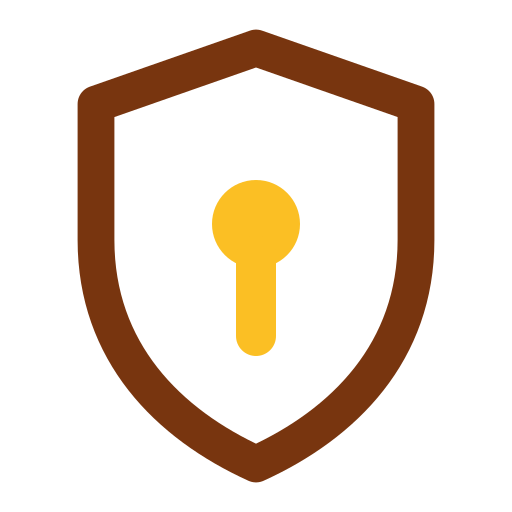

<!-- SPDX-FileCopyrightText: Cadasto B.V. -->
<!-- SPDX-License-Identifier: BUSL-1.1 -->
#  FerroSMART

The SMART on openEHR server, in pure Rust: who may act.

FerroEHR carries the SMART on openEHR layer today: the discovery document, the launch context, the scope grammar and the gate that enforces it on every request. FerroSMART pulls that layer out into a server of its own, so one place owns authorisation for the whole family. An application obtains its token and launch context here over OAuth 2.0 and OpenID Connect, and every server asks here whether the token it is handed may do what it asks.

FerroSMART is one of the [FerroHEALTH](https://ferrohealth.eu/) family. The family
page shows where it sits among the eight and what calls what, and this
repository is where the design and the build happen; the tracker is the
record of both. Its site will be <https://ferrosmart.eu/>.

## Licence

FerroSMART is source-available under the Business Source License 1.1. The
parameters that apply, the Licensor, the Licensed Work, the Additional Use
Grant and the Change Date, are in [LICENSE](LICENSE): free for non-commercial
production use, a commercial licence for any other production use, and Apache
2.0 four years after each version is published. The maintainer named in
[MAINTAINERS.md](MAINTAINERS.md) is the contact for a commercial licence.

The brand assets under `assets/brand/` are part of the Licensed Work.

Contributions carry the terms in
[CONTRIBUTING.md](CONTRIBUTING.md#licensing-of-contributions): you keep your
copyright, and you grant the Licensor the relicensing right that keeps the work
one work under one licensor. There is no separate agreement to sign.
